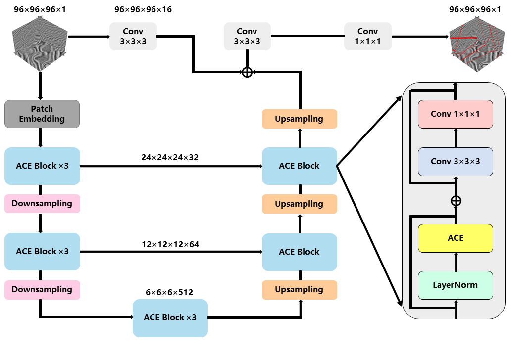

# ResACEUnet
<div align=center>
    
</div>

Detecting fault constitutes a pivotal aspect of seismic interpretation, significantly influencing the outcomes of petroleum and gas exploration. As artificial intelligence advances, Convolutional Neural Network (CNN) has proven effective in detecting faults in seismic interpretation. Nevertheless, the receptive field of convolutional layer within CNN is inherently limited, focusing on extracting local features, which leads to the detection of fewer and discontinuous fault features. In this study, integrating the local feature extraction capabilities of CNN with the global feature extraction prowess of Transformer, we proposed an U-shaped hybrid architecture model (ResACEUnet) to detect fault of three-dimensional (3D) seismic data. In ResACEUnet, we introduced a module called ACE block, which integrates convolution and attention mechanisms. This module enabled the model to simultaneously extract local features and model global contextual information, capturing more accurate fault features. In addition, we utilized a joint loss function composed of binary cross-entropy loss and Dice loss, to tackle the challenge of imbalanced positive and negative samples. The model was trained on a synthetic dataset, with a range of data augmentation techniques were employed to bolster its generalization capabilities and robustness. We implemented our proposed method on the offshore F3 seismic data from the Netherlands, and seismic data from Kerry3D and Parihaka in New Zealand. Compared to conventional CNN models such as Unet and ResUnet, ResACEUnet demonstrated superior capabilities in capturing more features and identifying fault with higher accuracy and continuity.
# Usage
```commandline
fault_detection/
      ├───── dataset/
      │        ├───── 200-20/
      │        │        ├───── train/
      │        │        │         ├───── images  # 200 train data put here
      │        │        │         └───── labels
      │        │        └───── val/
      │        │                  ├───── images  # 20 val data put here
      │        │                  └───── labels
      │ 
      │ 
      └───── ...
```
## Setting up the Environment
```commandline
conda env create -f environment.yml
```
## Downloading the Data
https://pan.baidu.com/s/1lRpVLENTZGpHfU5yOCYmZA?pwd=hq1m
## Loading the Data
```commandline
python process.py
```
## Running the Codes
```commandline
python main.py
```
