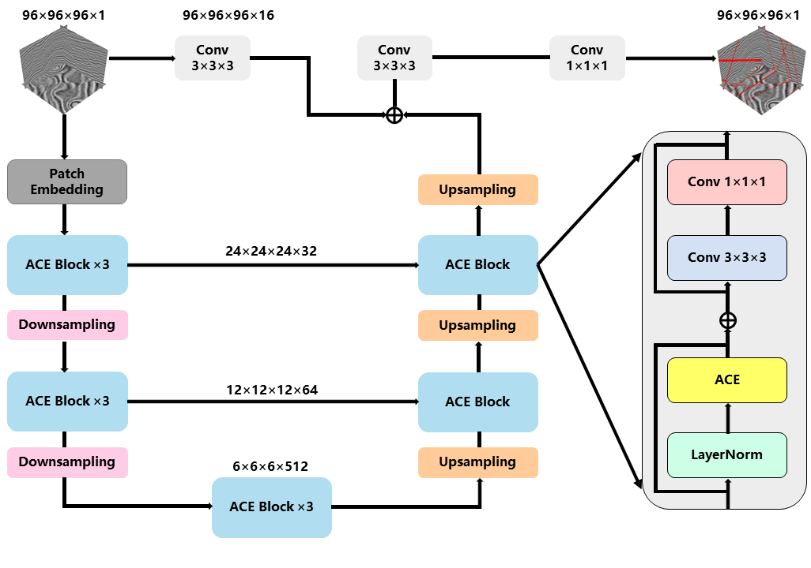

# ResACEUnet

[](https://doi.org/10.5281/zenodo.20339874)

<div align=center>
    
</div>

## Abstract

Detecting fault constitutes a pivotal aspect of seismic interpretation, significantly influencing the outcomes of petroleum and gas exploration. As artificial intelligence advances, Convolutional Neural Network (CNN) has proven effective in detecting faults in seismic interpretation. Nevertheless, the receptive field of convolutional layer within CNN is inherently limited, focusing on extracting local features, which leads to the detection of fewer and discontinuous fault features. In this study, integrating the local feature extraction capabilities of CNN with the global feature extraction prowess of Transformer, we proposed an U-shaped hybrid architecture model (ResACEUnet) to detect fault of three-dimensional (3D) seismic data. In ResACEUnet, we introduced a module called ACE block, which integrates convolution and attention mechanisms. This module enabled the model to simultaneously extract local features and model global contextual information, capturing more accurate fault features. In addition, we utilized a joint loss function composed of binary cross-entropy loss and Dice loss, to tackle the challenge of imbalanced positive and negative samples. The model was trained on a synthetic dataset, with a range of data augmentation techniques were employed to bolster its generalization capabilities and robustness. We implemented our proposed method on the offshore F3 seismic data from the Netherlands, and seismic data from Kerry3D and Parihaka in New Zealand. Compared to conventional CNN models such as Unet and ResUnet, ResACEUnet demonstrated superior capabilities in capturing more features and identifying fault with higher accuracy and continuity.

# Usage

```commandline
fault_detection/
      ├───── data/
      │        ├───── 200-20/
      │        │        ├───── train/
      │        │        │         ├───── images  # 200 train data put here
      │        │        │         └───── labels
      │        │        └───── val/
      │        │                  ├───── images  # 20 val data put here
      │        │                  └───── labels
      │        └───── test/
      │                 ├──── seismic/
      │                 │
      │                 └──── fault/
      └───── ...
```

## Environment Setup

```commandline
conda env create -n fault python=3.11 -y
conda activate fault
cd fault_detection
pip install -e .
git clone https://github.com/KeKsBoTer/torch-dwt
cd torch-dwt
pip install -e .
cd ..
```

## Training

Download the training datasets [https://zenodo.org/records/20339874](https://zenodo.org/records/20339874) and place the extracted files in the `data`.

Hyperparameters are set in `config/config.yaml`, which you can modify as needed.

In `config.yaml`, the path should be set to the ​​absolute path of the data files​​ followed by a /.

`main.py` line 283 needs to register for Weights & Biases (wandb) and obtain an API key.

```commandline
python main.py
```

## Testing

Place the data for prediction (in npy format) in the `data/test/seismic`.

The results of the prediction will be saved in the `data/test/fault`.

```commandline
python predict_3d.py
```

## Visualization

The seismic3D function in `util/result_3D.py` can be used to view 3D seismic images, and the fault3D function can be used to view 3D seismic fault images. Modify seismic_path and fault_path as needed.

## Tip

If an error occurs with NaN, it might be due to model initialization issues. Try running the process again or modify the seed and run again.

## Cite us

```bibtex
@article{zu2024resaceunet,
  title={ResACEUnet: An improved transformer Unet model for 3D seismic fault detection},
  author={Zu, Shaohuan and Zhao, Penghui and Ke, Chaofan and Junxing, Cao},
  journal={Journal of Geophysical Research: Machine Learning and Computation},
  volume={1},
  number={3},
  pages={e2024JH000232},
  year={2024},
  publisher={Wiley Online Library}
}
